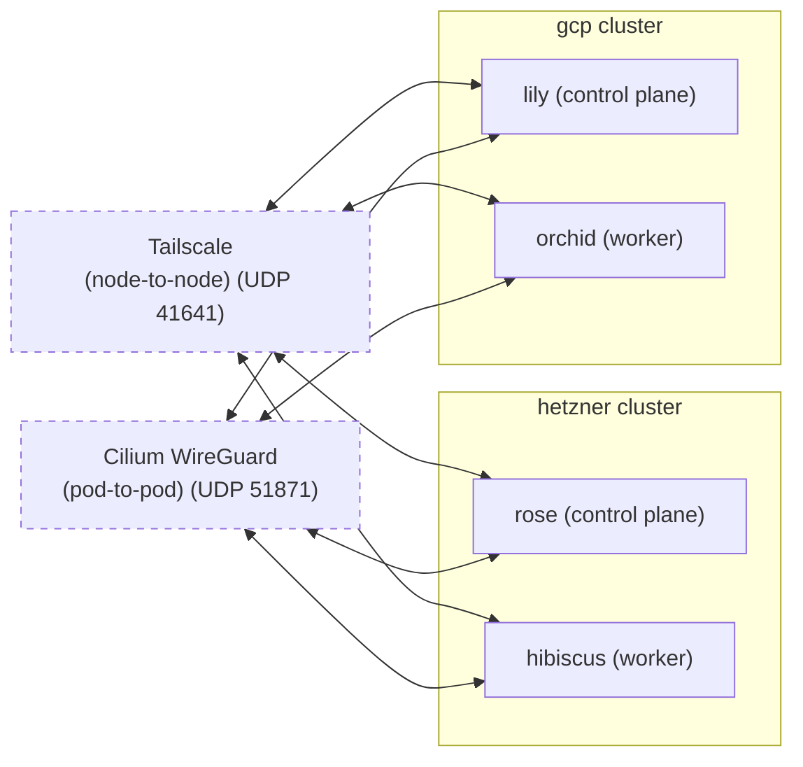

> [!WARNING]
> Please note that this project has not been tested in a production capacity. It has undergone extensive testing, but never ran production workloads.


## bouquet2.1

Infinitely scalable, multi-cloud, secure and network-agnostic declarative Kubernetes configuration provisioned with OpenTofu that focuses on stability and simplicity, while not compromising on modularity.

A fresh take on [bouquet2](https://github.com/bouquet2/bouquet2) based on the mistakes learned while managing it.

## Differences compared to bouquet2

* Rewritten from ground-up with LLMs
* No Kubernetes manifests (yet)
* Use Terragrunt Stack pattern instead of manual `live/` directory management
* Fully Cilium-compliant (fully passes `cilium connectivity test`)
  * Also uses Cilium WireGuard for pod-to-pod communication (node-to-node is handled by Tailscale)
* Cilium ClusterMesh for multi-cluster service discovery
* Config-driven cluster definitions via JSON
* Automated stack unit generation via `main.py`
* Rook Ceph block/object/file storage provisioned on-cluster
* Consolidated `modules/infra/` model — providers, Talos, Tailscale, DNS all integrated in one module
* Custom hooks that allow removal/addition of nodes as well as in-place machineconfig support
* Custom hook that allows removal of Tailscale nodes automatically (was a drawback on bouquet2)
* No packer required for setup
  * Uses rescue mode in Hetzner in order to install Talos Linux
  * or local-exec on GCP
* Cleaner structure that is easier to read and improve
* Supports multiple Cloud providers
  * GCP and Hetzner currently supported, AWS is coming soon(tm)
* Automatically gets the latest Kubernetes and Talos Linux version for the cluster
* Hetzner private network with deterministic per-node IP assignment for stable etcd peering
* Bootstrap depends on machine configuration apply, fixing timing race conditions present in bouquet2

## Setup

### Prerequisites

#### Cloud Providers
* Hetzner
  * [Hetzner Console API key](https://docs.hetzner.com/cloud/api/getting-started/generating-api-token/)
* Google Cloud Platform (GCP)
  * Authenticate using Application Default Credentials (ADC):
    ```bash
    gcloud auth application-default login
    ```
  * Service Account with the following IAM roles:
    * `roles/compute.admin` - Manage compute instances, images, and firewalls
    * `roles/storage.admin` - Manage GCS buckets for Talos images
    * `roles/iam.serviceAccountUser` - Required if using service accounts on instances

#### Software
* [OpenTofu](https://opentofu.org)
* [Terragrunt](https://terragrunt.gruntwork.io)
* [kubectl](https://kubernetes.io/docs/tasks/tools/)
* [talosctl](https://www.talos.dev/v1.9/introduction/quickstart/#talosctl)

#### Credentials
* [Tailscale OAuth Secret and ID with RW on devices:core, auth_keys, acl](https://tailscale.com/docs/features/oauth-clients)
  * If you don't enable `manage_acl` you will have to add the required role and ACL yourself.
* [Hetzner Console API key](https://docs.hetzner.com/cloud/api/getting-started/generating-api-token/)
* [GCP Application Default Credentials](https://cloud.google.com/docs/authentication/provide-credentials-adc) - Run `gcloud auth application-default login`
* [Cloudflare API key with Zone.DNS Edit permission](https://developers.cloudflare.com/fundamentals/api/get-started/create-token/)
  * Currently only Cloudflare DNS is supported, Hetzner might be added at some point

### Setup

#### Config file

```bash
cp config.json.example config.json
vim config.json
```

Multiple configs are supported via the `--config` argument:

```bash
# Generate stack units from config
python3 main.py --config config.json
python3 main.py --config config-gcpha-multicluster.json
```

#### Secrets (choose one method)

**Option 1: secrets.hcl (default)**

```bash
cp secrets.hcl.example secrets.hcl
vim secrets.hcl  # add your secrets
```

**Option 2: 1Password**

Set `enable_onepassword = true` in your `config.json` and provide your account:

```json
{
  "enable_onepassword": true,
  "onepassword_account": "your-account.1password.com"
}
```

1. Enable "Integrate with other apps" in the 1Password desktop app (Settings > Developer > Integrate with the 1Password SDKs)
2. Create items in your vault (default: `Infrastructure`).

#### Generate Stack Units

The stack units are defined in `terragrunt.stack.hcl` and can be auto-generated from `config.json`:

```bash
python3 main.py
```

This reads your config JSON and populates the unit blocks in `terragrunt.stack.hcl` for each cluster.

#### Deploy

Commands run from the project root. `main.py` handles stack generation, kubeconfig extraction, and ClusterMesh setup.

```bash
# Generate stack units from config and plan
python3 main.py --config config.json plan

# Apply all cluster infrastructure
python3 main.py --config config.json apply

# Destroy everything
python3 main.py --config config.json destroy
```

## Architecture

### Deployment Flow

1. **Config JSON** defines clusters, nodes, and features (Ceph, DNS, Tailscale, etc.)
2. **Terragrunt Stack** reads the config and creates per-cluster deployment units
3. Each unit provisions:
   - Cloud provider resources (Hetzner server / GCP instances)
   - Talos Linux installation and machine configuration
   - Tailscale mesh networking on every node
   - Kubernetes cluster bootstrap
   - kubeconfig generation
   - Cilium CNI (with ClusterMesh for multi-cluster)
   - DNS records (per-node A/AAAA, LB, internal)
   - Rook Ceph operator and storage cluster
4. Platform addons are deployed via the platform module

### Networking

- **Tailscale**: All nodes join a tailnet. Node-to-node communication (API server, etcd, Ceph) goes over Tailscale's WireGuard mesh.
- **Cilium**: CNI with `kubeProxyReplacement=true`. Routing mode is configurable (`native` or `tunnel`, default `native`). Cilium WireGuard encryption is optional (pod-to-pod only by default; `nodeEncryption` can be enabled separately).
- **Cilium ClusterMesh**: Cross-cluster communication via Tailscale, enabling multi-cluster service discovery.
- **Hetzner Private Network**: Static per-node private IPs (`10.{network}.1.N` for control planes, `10.{network}.2.N` for workers) provide stable etcd peer endpoints.

## Features

- **Multi-cloud**: Mix GCP and Hetzner nodes in the same cluster
- **Multi-cluster**: Run multiple independent clusters, connected via Cilium ClusterMesh
- **Tailscale**: All nodes join a tailnet; Tailscale IPs used for API server, Cilium ClusterMesh, and inter-cluster Ceph
- **Cilium**: Full Cilium CNI with WireGuard encryption and ClusterMesh
- **Rook Ceph**: On-cluster block (RBD), filesystem (CephFS), and object (RGW) storage
- **Config-driven**: All cluster topology and features in a single JSON config
- **Auto-versioning**: Latest Kubernetes, Talos, and Cilium versions fetched automatically

## Ceph Storage

Rook Ceph is deployed on each cluster with:
- Block storage via `ceph-block` StorageClass (RBD CSI)
- Filesystem storage via `ceph-filesystem` StorageClass (CephFS CSI, default)
- Object storage via RGW (optional)
- Configurable OSD devices per provider (GCP persistent disks or Hetzner volumes)

## Servers

> [!TIP]
> This is just the default configuration, you can configure the nodes however you want.

### Hetzner Cloud Example

* rose
    * Cloud: Hetzner Cloud
    * Region: Helsinki
    * OS: Talos Linux
    * Role: Control plane node
    * Machine: CX23 (Intel) with 2 vCPU, 4GB RAM, 40GB storage
 
* hibiscus
    * Cloud: Hetzner Cloud
    * Region: Helsinki
    * OS: Talos Linux
    * Role: Worker node
    * Machine: CX23 (Intel) with 2 vCPU, 4GB RAM, 40GB storage

### GCP Example

* lily
    * Cloud: Google Cloud Platform
    * Region: us-central1
    * OS: Talos Linux
    * Role: Control plane node
    * Machine: e2-standard-2 with 2 vCPU, 8GB RAM, 50GB storage

* orchid
    * Cloud: Google Cloud Platform
    * Region: us-central1
    * OS: Talos Linux
    * Role: Worker node
    * Machine: e2-standard-2 with 2 vCPU, 8GB RAM, 50GB storage

### System Architecture Overview


## License

bouquet2.1 is free software: you can redistribute it and/or modify
it under the terms of the GNU Affero General Public License as published
by the Free Software Foundation, either version 3 of the License, or
(at your option) any later version.

bouquet2.1 is distributed in the hope that it will be useful,
but WITHOUT ANY WARRANTY; without even the implied warranty of
MERCHANTABILITY or FITNESS FOR A PARTICULAR PURPOSE.  See the
GNU Affero General Public License for more details.

You should have received a copy of the GNU Affero General Public License
along with bouquet2.1.  If not, see <https://www.gnu.org/licenses/>.
