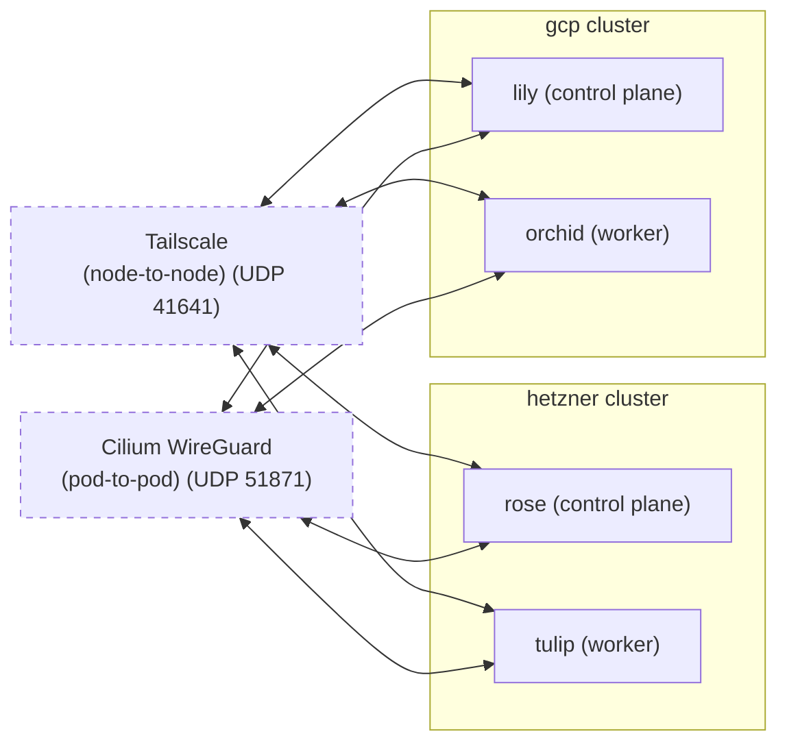

> [!WARNING]
> Please note that this project has not been tested in a production capacity. It has undergone extensive testing, but never ran production workloads.


## bouquet2.1

Infinitely scalable, multi-cloud, secure and network-agnostic declarative Kubernetes configuration provisioned with OpenTofu that focuses on stability and simplicity, while not compromising on modularity.

A fresh take on [bouquet2](https://github.com/bouquet2/bouquet2) based on the mistakes learned while managing it.


## Differences compared to bouquet2
* Rewritten from ground-up with LLMs
* No Kubernetes manifests (yet)
* Use `null_resource` on OpenTofu instead of doing cleanup with `just`
* Fully Cilium-compliant (fully passes `cilium connectivity test`)
  * Also uses Cilium WireGuard for pod-to-pod communication (node-to-node is handled by Tailscale)
* Cilium is now managed by in-line manifests entirely
* Custom hooks that allow removal/addition of nodes as well as in-place machineconfig support
* Custom hook that allows removal of Tailscale nodes automatically (was a drawback on bouquet2)
* No packer required for setup
  * Uses rescue mode in Hetzner in order to install Talos Linux
  * or local-exec on GCP
* Cleaner structure that is easier to read and improve
* Supports multiple Cloud providers
  * GCP and Hetzner currently supported, AWS is coming soon(tm)
* Automatically gets the latest Kubernetes and Talos Linux version for the cluster

## Setup

### Prerequisites

#### Cloud Providers
* Hetzner
  * [Hetzner Console API key](https://docs.hetzner.com/cloud/api/getting-started/generating-api-token/)
* Google Cloud Platform (GCP)
  * Authenticate using Application Default Credentials (ADC):
    ```bash
    gcloud auth application-default login
    ```
  * Service Account with the following IAM roles:
    * `roles/compute.admin` - Manage compute instances, images, and firewalls
    * `roles/storage.admin` - Manage GCS buckets for Talos images
    * `roles/iam.serviceAccountUser` - Required if using service accounts on instances
  * Or create a custom role with these permissions:
    ```json
    {
      "permissions": [
        "compute.instances.create",
        "compute.instances.delete",
        "compute.instances.get",
        "compute.instances.list",
        "compute.instances.start",
        "compute.instances.stop",
        "compute.instances.update",
        "compute.images.create",
        "compute.images.delete",
        "compute.images.get",
        "compute.images.list",
        "compute.firewalls.create",
        "compute.firewalls.delete",
        "compute.firewalls.get",
        "compute.firewalls.list",
        "compute.firewalls.update",
        "compute.networks.get",
        "compute.networks.list",
        "compute.subnetworks.get",
        "compute.subnetworks.list",
        "storage.buckets.create",
        "storage.buckets.delete",
        "storage.buckets.get",
        "storage.buckets.list",
        "storage.objects.create",
        "storage.objects.delete",
        "storage.objects.get",
        "storage.objects.list"
      ]
    }
    ```

#### Software
* [OpenTofu](https://opentofu.org)
* [kubectl](https://kubernetes.io/docs/tasks/tools/)
* [talosctl](https://www.talos.dev/v1.9/introduction/quickstart/#talosctl)

#### Credentials
* [Tailscale OAuth Secret and ID with RW on devices:core, auth_keys, acl](https://tailscale.com/docs/features/oauth-clients)
  * If you don't enable `manage_acl` you will have to add the required role and ACL yourself.
* [Hetzner Console API key](https://docs.hetzner.com/cloud/api/getting-started/generating-api-token/)
* [GCP Application Default Credentials](https://cloud.google.com/docs/authentication/provide-credentials-adc) - Run `gcloud auth application-default login`
* [Cloudflare API key with Zone.DNS Edit permission](https://developers.cloudflare.com/fundamentals/api/get-started/create-token/)
  * Currently only Cloudflare DNS is supported, Hetzner might be added at some point

### Setup

#### Secrets (choose one method)

**Option 1: 1Password (default)**

Secrets are fetched from 1Password automatically when no `-var-file=secrets.tfvars` is provided.

1. Enable "Integrate with other apps" in the 1Password desktop app
   (Settings > Developer > Integrate with the 1Password SDKs)
2. Set your 1Password account name (as shown in the app sidebar) either:
   - In `terraform.tfvars.json`: `"onepassword_account": "your-account-name"`
   - Or via environment variable: `export OP_ACCOUNT="your-account-name"`
3. Create items in your "Infrastructure" vault (only the ones you use):
   - `bouquet-hcloud-token` — Hetzner Cloud API token (password field)
   - `bouquet-cloudflare-api-token` — Cloudflare API token (password field)
   - `bouquet-tailscale-oauth-secret` — Tailscale OAuth secret (if using Tailscale)
   - `bouquet-tailscale-oauth-client-id` — Tailscale OAuth client ID (if using Tailscale)
   - `bouquet-gcp-credentials` — GCP service account JSON (if using GCP)

**Option 2: secrets.tfvars (fallback)**

```bash
cp secrets.tfvars.example secrets.tfvars
vim secrets.tfvars  # add your secrets
```

#### Deploy

```bash
cp terraform.tfvars.json.example terraform.tfvars.json
vim terraform.tfvars.json

# With 1Password (secrets fetched automatically):
tofu init
tofu plan -var-file=terraform.tfvars.json
tofu apply -var-file=terraform.tfvars.json

# With secrets.tfvars:
tofu plan -var-file=terraform.tfvars.json -var-file=secrets.tfvars
tofu apply -var-file=terraform.tfvars.json -var-file=secrets.tfvars

# Destroying the cluster
tofu destroy -var-file=terraform.tfvars.json
```


## Servers

> [!TIP]
> This is just the default configuration, you can configure the nodes however you want.

### Hetzner Cloud Example

* rose
    * Cloud: Hetzner Cloud
    * Region: Helsinki
    * OS: Talos Linux
    * Role: Control plane node
    * Machine: CX23 (Intel) with 2 vCPU, 4GB RAM, 40GB storage
 
* tulip
    * Cloud: Hetzner Cloud
    * Region: Helsinki
    * OS: Talos Linux
    * Role: Worker node
    * Machine: CX23 (Intel) with 2 vCPU, 4GB RAM, 40GB storage

### GCP Example

* lily
    * Cloud: Google Cloud Platform
    * Region: us-central1
    * OS: Talos Linux
    * Role: Control plane node
    * Machine: e2-standard-2 with 2 vCPU, 8GB RAM, 50GB storage

* orchid
    * Cloud: Google Cloud Platform
    * Region: us-central1
    * OS: Talos Linux
    * Role: Worker node
    * Machine: e2-standard-2 with 2 vCPU, 8GB RAM, 50GB storage

### System Architecture Overview


## License

bouquet2.1 is free software: you can redistribute it and/or modify
it under the terms of the GNU Affero General Public License as published
by the Free Software Foundation, either version 3 of the License, or
(at your option) any later version.

bouquet2.1 is distributed in the hope that it will be useful,
but WITHOUT ANY WARRANTY; without even the implied warranty of
MERCHANTABILITY or FITNESS FOR A PARTICULAR PURPOSE.  See the
GNU Affero General Public License for more details.

You should have received a copy of the GNU Affero General Public License
along with bouquet2.1.  If not, see <https://www.gnu.org/licenses/>.
