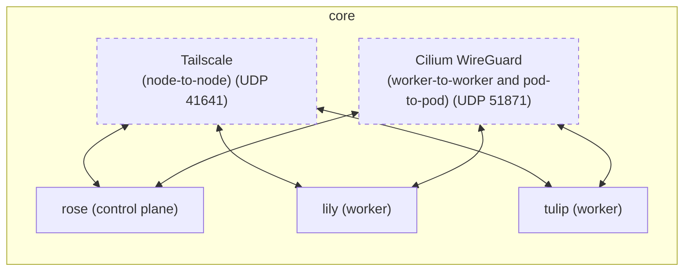

> [!WARNING]
> Please note that this project has not been tested in a production capacity. It has undergone extensive testing, but never ran production workloads.


## bouquet2.1

Infinitely scalable, multi-cloud, secure and network-agnostic declarative Kubernetes configuration provisioned with OpenTofu that focuses on stability and simplicity, while not compromising on modularity.

A fresh take on [bouquet2](https://github.com/bouquet2/bouquet2) based on the mistakes learned while managing it.


## Differences compared to bouquet2
* Rewritten from ground-up with LLMs
* No Kubernetes manifests (yet)
* Use `null_resource` on OpenTofu instead of doing cleanup with `just`
* Fully Cilium-compliant (fully passes `cilium connectivity test`)
  * Also uses Cilium WireGuard for pod-to-pod communication (node-to-node is handled by Tailscale)
* Cilium is now managed by in-line manifests entirely
* Custom hooks that allow removal/addition of nodes as well as in-place machineconfig support
* Custom hook that allows removal of Tailscale nodes automatically (was a drawback on bouquet2)
* No packer required for setup
  * Uses rescue mode in Hetzner in order to install Talos Linux
* Cleaner structure that is easier to read and improve


## Setup

### Prerequisites

#### Software
* [OpenTofu](https://opentofu.org)
* [kubectl](https://kubernetes.io/docs/tasks/tools/)
* [talosctl](https://www.talos.dev/v1.9/introduction/quickstart/#talosctl)

#### Credentials
* [Tailscale OAuth Secret and ID with RW on devices:core, auth_keys](https://tailscale.com/docs/features/oauth-clients)
  * You also need to add `tag:k8s-operator` (or any tag) that can access every other node using ACL like so;
  ```json
    {
			"action": "accept",
			"src": [
				"tag:k8s-operator",
			],
			"dst": [
				"tag:k8s-operator:*",
			],
    }
   ```
* [Hetzner Console API key](https://docs.hetzner.com/cloud/api/getting-started/generating-api-token/)
* [Cloudflare API key with Zone.DNS Edit permission](https://developers.cloudflare.com/fundamentals/api/get-started/create-token/)
  * Currently only Cloudflare DNS is supported, Hetzner might be added at some point

### Setup
```bash
# Deploying the cluster
cp secrets.tfvars.example secrets.tfvars

### Edit secrets.tfvars and add your secrets
vim secrets.tfvars

### Edit terraform.tfvars.json and update Tailscale, Cloudflare credentials 
vim terraform.tfvars.json

### Planning the deployment
tofu plan -var-file=terraform.tfvars.json -var-file=secrets.tfvars

### Deploying the deployment
tofu apply -var-file=terraform.tfvars.json -var-file=secrets.tfvars

# Destroying the cluster
tofu destroy -var-file=terraform.tfvars.json -var-file=secrets.tfvars
```


## Servers

> [!TIP]
> This is just the default configuration, you can configure the nodes however you want.

* rose
    * Cloud: Hetzner Cloud
    * Region: Falkenstein
    * OS: Talos Linux
    * Role: Control plane node
    * Machine: CX23 (Intel) with 2 vCPU, 4GB RAM, 40GB storage
 
* lily
    * Cloud: Hetzner Cloud
    * Region: Falkenstein
    * OS: Talos Linux
    * Role: Worker node
    * Machine: CX23 (Intel) with 2 vCPU, 4GB RAM, 40GB storage

* tulip
    * Cloud: Hetzner Cloud
    * Region: Falkenstein
    * OS: Talos Linux
    * Role: Worker node
    * Machine: CX23 (Intel) with 2 vCPU, 4GB RAM, 40GB storage

### System Architecture Overview


## License

bouquet2.1 is free software: you can redistribute it and/or modify
it under the terms of the GNU Affero General Public License as published
by the Free Software Foundation, either version 3 of the License, or
(at your option) any later version.

bouquet2.1 is distributed in the hope that it will be useful,
but WITHOUT ANY WARRANTY; without even the implied warranty of
MERCHANTABILITY or FITNESS FOR A PARTICULAR PURPOSE.  See the
GNU Affero General Public License for more details.

You should have received a copy of the GNU Affero General Public License
along with bouquet2.1.  If not, see <https://www.gnu.org/licenses/>.
